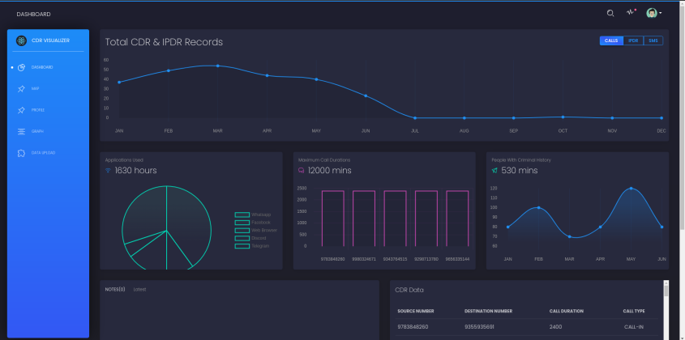
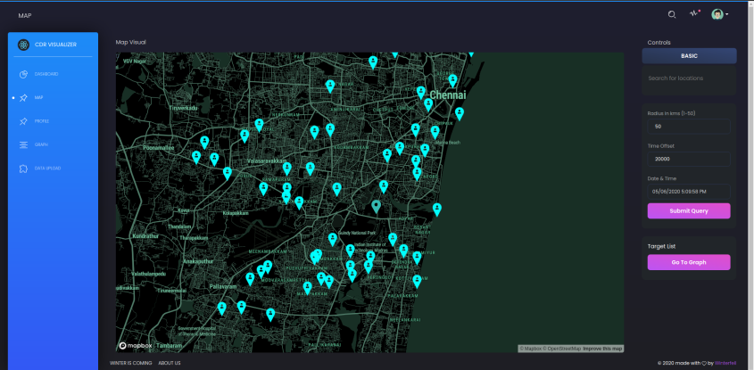
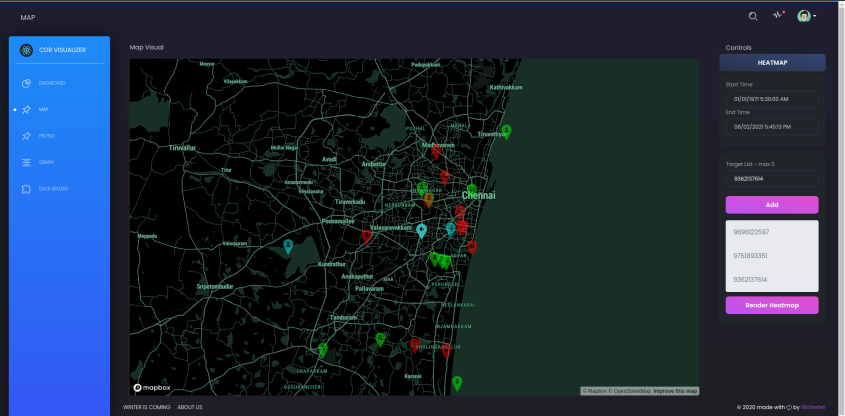
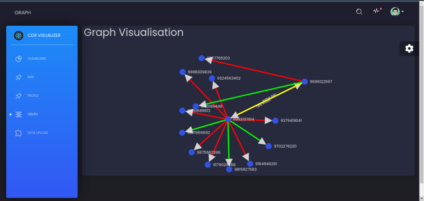

## Inspiration

This project was built during the finals of Smart India Hackathon 2020 for the Bureau of Police Research and Development  (BPRD). The problems this project aims to overcome are described in the the problem statement Rk_312 for BPRD. 

## About

Call Data Records (CDR) and Internet Protocol Detail Records (IPDR) related to cyber offenders are very important for Law Enforcement Agencies (LEAs). CDR and IPDR data available presently is generally found in a Spreadsheet, Excel or CSV file format. It is a tedious process to draw conclusions from raw CDR and IPDR data. Hence, this project aims to provide a graphical visualization of this data to more intutively and efficiently interpret this data. Our solution takes different files as inputs in the formats like .XLSX, .CSV, TXT. and it converts them into graphs connecting users (phone numbers) via their calls and ip data exchanged. 

## Features

- [X] Functionality to populate DBs upload CDR, IPDR files in CSV format.  
- [X] Provides an interactive map with location and time filters to visualize cdr records.
- [X] Constructs a heatmap of all the locations visited by a node (phone number) over a time range
- [X] Profile dashboard to show all relevant insights and information about a specific node (phone number) 
- [X] Provides a graph visualization of nodes depicting outgoing / incoming calls & SMS as edges thus forming a network of associated nodes.
- [X] Depicts visually the strength of the relationships between nodes utilizing a weighted sum of total call durations, number of calls and number of SMSes as a gradient from green (weakly related) to red(strongly related).
- [X] Identifies phone numbers which possess the same imei and vice versa denoted by a yellow edge.   
- [X] Allows for addition of notes for edges and nodes in the graph for future reference
- [X] Allows for querying profiles using name, email, imei, imsi and aadhar and phone numbers.  
- [ ] Generating a PDF report of visualized graphs, maps and notes.
- [ ] Toggle between graph and map mode using the same set of nodes
- [ ] Extracting data from various CDR and IPDR files with different formats


## Screenshots







## Requirements

1) nodejs >= 14.5
2) mongodb

## Setup Instructions

1) In both client and server folders, run
```
npm install
```

2) Replace your mapbox api key in *.env.local* after executing the following command 

```
cp .env.example .env.local
```

## Starting application

Start client and server by using the command

```
npm start
```

